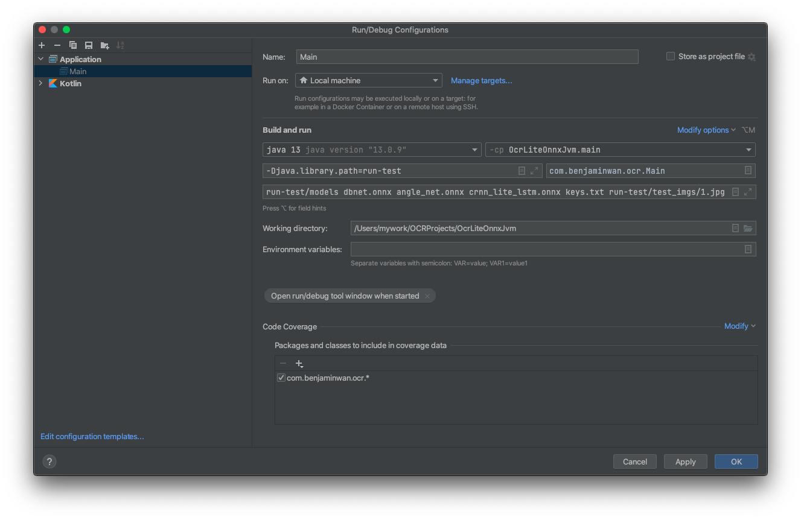

# RapidOcrOnnxJvm

### Project下载

* 整合好源码和依赖库的完整工程项目，可在Release中下载(github)
* 可到Q群共享内下载，找Project_RapidOcrOnnxJvm压缩包文件
* QQ群号：887298230(已满)，2群(755960114)
* 如果想自己折腾，则请继续阅读本说明

### Demo下载(win、mac、linux)

编译好的demo，可以到Q群共享内下载 或者Release下载

* jni部分代码请参考[C++项目](https://github.com/RapidAI/RapidOcrOnnx)
* 各PC平台jni库[下载](https://github.com/RapidAi/RapidOcrOnnx/releases)
* 因为jvm代码不常更新，可以把新版的jni库(例1.1.0)替换到旧版的demo里(比如1.0.0)

### 介绍

* 本项目为java或kotlin通过jni调用RapidOcrOnnx动态运行库的范例。

### 编译环境

1. jdk 1.8(参考动态运行库编译说明安装)
2. gradle(可由IDE自动安装)
3. IDE: IDEA 2021.2

### 调试&编译说明

1. 开始JVM部分编译之前，请先完成编译RapidOcrOnnx动态运行库，参考[此页面](https://github.com/RapidAI/RapidOcrOnnx)的编译说明。
2. 把预先编译好的动态运行库复制到run-test文件夹，根据您选择的编译类型，macOS、linux可能还需要额外配置动态库的搜索路径
3. 从第1步的说明中找到模型下载地址，放到run-test/models文件夹，测试的目标图片放到run-test/images文件夹
4. 用IDEA打开本项目
5. Main.java为java版调用范例，main.kt为kotlin版调用范例，之后以kotlin为范例来说明
6. IDEA中直接在在main方法左边点击绿色的运行图标，可以直接调试运行范例，但此时没有输入参数。

* 编辑运行参数：顶部工具栏“运行”图标左边，点开下拉菜单“Edit Configurations”
* VM options:添加```-Djava.library.path=run-test```，把run-test文件夹加到java的lib搜索路径
* Program arguments:添加``run-test/models ch_PP-OCRv3_det_infer.onnx ch_ppocr_mobile_v2.0_cls_infer.onnx ch_PP-OCRv3_rec_infer.onnx ppocr_keys_v1.txt run-test/images/1.jpg```
  ，添加命令行输入参数
* 命令行参数models文件夹里必须有相应的模型文件，接下来的四个文件名对应模型文件夹里的3个模型(含扩展名)和1个keys文件，请确认文件名无误
* run-test/images/1.jpg是待识别的目标图片
* 点击运行，正常的话就可以输出识别结果。

8. 编译为jar包(以Kotlin为例)：在菜单栏找到Project Structure

* 转到“Artifacts”选项卡
* 按“+”号新建配置，Add->Jar->Empty
* 编辑Name:RapidOcrOnnxJvm，下面列表左边的名称也会对应改为“RapidOcrOnnxJvm.jar”，这是最终输出的文件名
* 选中左边列表的“RapidOcrOnnxJvm.jar”，底部出现两个按钮，选择“Use Existing Manifest...”，选择src/main/resources/META-INF/MANIFEST.MF
* 展开右边列表，找到RapidOcrOnnxJvm/main/“RapidOcrOnnxJvm.main compile output”，右键“Put into Output Root”
* 选中右边列表的几个Gradle依赖包，“kotlin-stdlib-xxx:版本”/“annotations:版本”，右键“Extract Into Output
  Root”
* 按“OK”关闭项目设置窗口
* 打开菜单栏Build->Build Artifacts，找到刚才的配置，并选Build
* 找到out/artifacts/RapidOcrOnnxJvm/RapidOcrOnnxJvm.jar，并复制到run-test文件夹
* 测试jar包是否正确编译：顶部Demo下载解压，把编译出来的jar包复制替换进去，然后使用run-test脚本测试。

  

### 其它问题

1. windows部署时如果运行显示错误can’t find dependent libraries

* 检查是否安装C++运行环境，https://support.microsoft.com/zh-cn/help/2977003/the-latest-supported-visual-c-downloads
  下载安装：vc_redist.x64.exe

2. 运行Java Main时出现

```
Error: A JNI error has occurred, please check your installation and try again
Exception in thread "main" java.lang.UnsupportedClassVersionError: com/benjaminwan/ocr/Main has been compiled by a more recent version of the Java Runtime (class file version 55.0), this version of the Java Runtime only recognizes class file versions up to 52.0
```

* 配置Project-> ProjectSDK: 选择合适的版本，最好跟以下的选项一致
* 配置JAVA Runtime版本：调试运行按钮旁边-> Edit Configurations-> Build And Run-> 选择合适的版本
* 修改Preferences-> Build,Execution,Deployment-> Gradle-> Gradle JVM:选择合适的版本(跟运行时JAVA版本相关)
  
  
  

## 示例图

* Java Main运行配置
  

* Kotlin Main运行配置
  

* 运行结果
  
